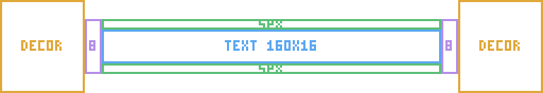

# Fixed discovery banner layout

All discovery banners use the same native **256×44 PNG** format, derived from
the Birch Forest camp template. Coordinates below use exclusive right/bottom
bounds. The canvas center is **(128,22)**.

## Drawing template

Download the **256 × 44 px** [labeled template](discovery-banner-template-guide.png)
or the [outline-only template](discovery-banner-template-outline.png). Both have
a transparent background, one-pixel outlines and no partially transparent pixels.
The preview above is enlarged 3× with nearest-neighbor scaling; use the linked
native-size PNGs for drawing.

Blue marks the **160 × 16 px** text panel; green marks the **5 px** rails;
purple marks the **8 px** side joints; gold marks the decoration areas.
Use the PNG as a guide layer, draw your original artwork on another layer, and
hide the guide before exporting. Keep the full canvas and draw no title into it.

These geometric drawing templates are original documentation examples under
the [MIT License](LICENSE). They contain no WD banner artwork.

| Element | Rectangle | Size |
| --- | --- | --- |
| Text background/panel | `(48,14)` to `(208,30)` | 160×16 |
| Top rail | `(48,9)` to `(208,14)` | 160×5 |
| Bottom rail | `(48,30)` to `(208,35)` | 160×5 |
| Left joint | `(40,9)` to `(48,35)` | 8×26 |
| Right joint | `(208,9)` to `(216,35)` | 8×26 |
| Left outer decoration | X 0–39 | Within canvas height |
| Right outer decoration | X 216–255 | Within canvas height |

Keep the top and bottom rails equally thick and the panel centered at Y=22.
Decorations may differ in style, but should remain visually balanced and within
the canvas. Do not move or resize the panel to compensate for text in code.

WD centers actual glyph bounds including the shadow, uses one common text-scale
limit, and fits text to the shared panel. It has no per-banner layout offsets.
The camp impact can briefly scale the whole banner; its source dimensions remain
256×44 and the same panel contract still applies.

Base texture alpha must be **0 or 255**. No partially transparent edge pixels,
antialiased outlines or resampled soft pixels belong in the base pixel artwork.
Runtime glow opacity is separate and may be soft.

See [machine-readable coordinates](discovery-banner-layout.json) and the
[reference template](discovery-banner-template.png). The PNG is a layout reference
and remains a WD game asset under Wake The Wild License 1.0. It is not an MIT
asset for redistribution. Documentation prose and coordinate data are MIT.
